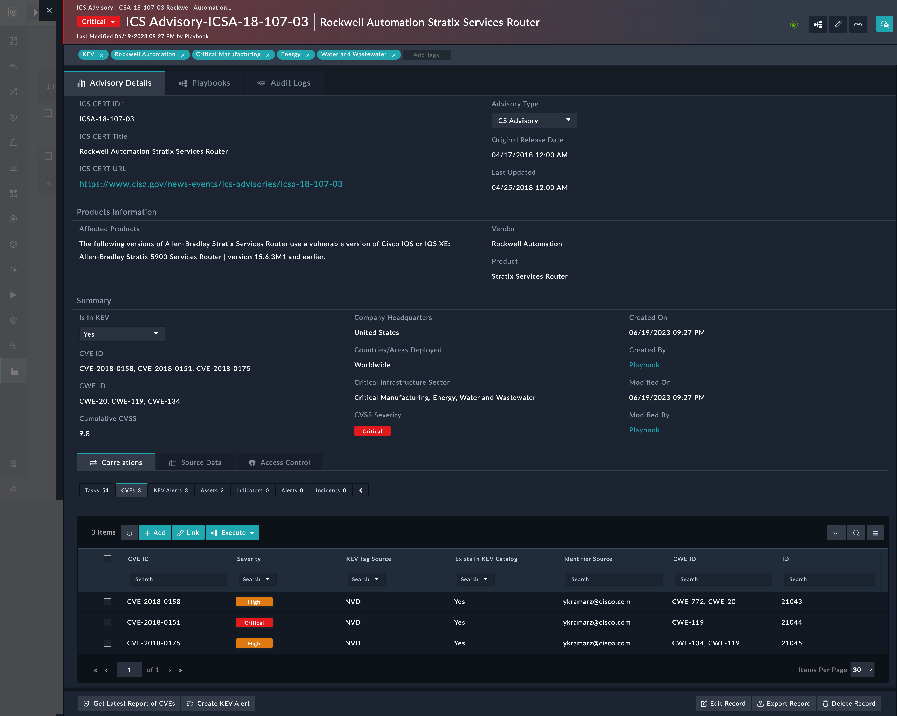
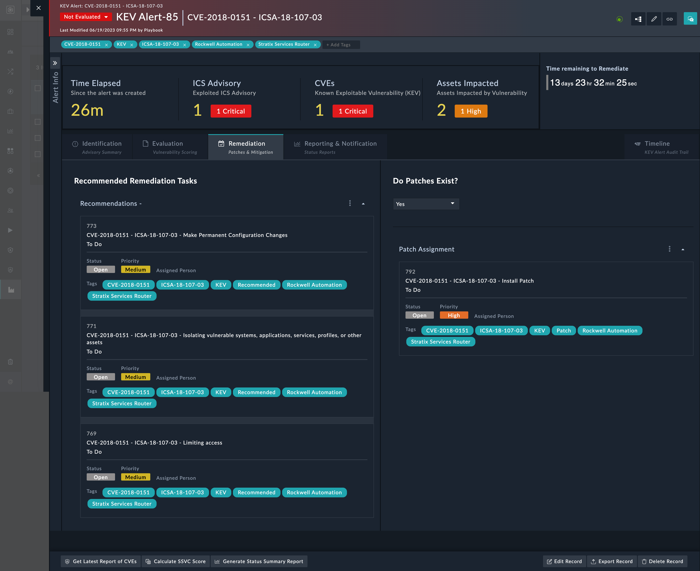

| [Home](../README.md) |
| -------------------- |

# Usage

Refer to [Simulate Scenario documentation](https://github.com/fortinet-fortisoar/solution-pack-soc-simulator/blob/develop/docs/usage.md) to understand how to simulate and reset scenarios.

To understand the process FortiSOAR follows to manage vulnerabilities in Operational Technology (OT), we have included a simulation mode. It provides a solution for handling the Known Exploited Vulnerability (KEV) CVEs under ICS Advisories . We have included a scenario &mdash; **OT - Known Exploit Vulnerability (KVE) Alert Raised For Asset At Risk** with this solution pack.

Refer to the section **OT - Vulnerability Management** to understand how this solution pack automation addresses your needs.

## Simulation mode

The simulation mode has some sample data that helps you get a better understanding of how the solution pack functions. The following steps help you use the solution pack with some included sample data.

### Before Running the Simulation:

1. To get real data of listed CVEs configure **NIST National Vulnerability Database (NVD)**

**OT - Known Exploited Vulnerability (KEV) Alert Raised For Asset At Risk**

- Set global variable **Demo_mode** as **true**.
- Browse to **Simulations** > **OT - Known Exploited Vulnerability (KEV) Alert Raised For Asset At Risk** scenario and click Simulate Scenario.
- List of Records gets created.
    - Assets:
        - Stratix Services Router - 6241
        - Stratix Services Router - RA41RT
    - CVEs:
        - CVE-2018-0158, CVE-2018-0151, CVE-2018-0175
    - ICS Advisory:
        - Rockwell Automation Stratix Services Router - (ICSA-18-107-03)
    - Known Exploited Vulnerability (KVE) Alert:
        - Known Exploited Vulnerability (KEV) CVE CVE-2018-0158 associated with product Stratix Industrial Managed Ethernet
        - Known Exploited Vulnerability (KEV) CVE CVE-2018-0151 associated with product Stratix Industrial Managed Ethernet
        - Known Exploited Vulnerability (KEV) CVE CVE-2018-0175 associated with product Stratix Industrial Managed Ethernet
        > **Note** These alert gets created once exploited CVEs are found in ICS Advisory.
    - Mandatory Tasks (Under Evaluation Tab):
        - CVE-2018-0158 - ICSA-18-107-03 - State Of Exploitation **Urgent**
        - CVE-2018-0158 - ICSA-18-107-03 - Technical Impact **Urgent**
        - CVE-2018-0158 - ICSA-18-107-03 - Automatable **Urgent**
        - CVE-2018-0158 - ICSA-18-107-03 - Mission Prevalence **Urgent**
        - CVE-2018-0158 - ICSA-18-107-03 - Public Well-Being Impact **Urgent**
        - CVE-2018-0158 - ICSA-18-107-03 - Mitigation Status **Urgent**
        - CVE-2018-0151 - ICSA-18-107-03 - State Of Exploitation **Urgent**
        - CVE-2018-0151 - ICSA-18-107-03 - Technical Impact **Urgent**
        - CVE-2018-0151 - ICSA-18-107-03 - Automatable **Urgent**
        - CVE-2018-0151 - ICSA-18-107-03 - Mission Prevalence **Urgent**
        - CVE-2018-0151 - ICSA-18-107-03 - Public Well-Being Impact **Urgent**
        - CVE-2018-0151 - ICSA-18-107-03 - Mitigation Status **Urgent**
        - CVE-2018-0175 - ICSA-18-107-03 - State Of Exploitation **Urgent**
        - CVE-2018-0175 - ICSA-18-107-03 - Technical Impact **Urgent**
        - CVE-2018-0175 - ICSA-18-107-03 - Automatable **Urgent**
        - CVE-2018-0175 - ICSA-18-107-03 - Mission Prevalence **Urgent**
        - CVE-2018-0175 - ICSA-18-107-03 - Public Well-Being Impact **Urgent**
        - CVE-2018-0175 - ICSA-18-107-03 - Mitigation Status **Urgent**
    - Recommended Tasks (Under Remediation Tab):
        - CVE-2018-0158 - ICSA-18-107-03 - Make Permanent Configuration Changes
        - CVE-2018-0158 - ICSA-18-107-03 - Isolating vulnerable systems, applications, services, profiles, or other assets
        - CVE-2018-0158 - ICSA-18-107-03 - Limiting access
- To get the latest report of CVEs from NIST-NVD, execute the playbook **Get Latest Report Of CVEs**
- Identification tab contains the steps to be performed.
- Execute the appropriate playbook that is available by task type to complete all the **Mandatory Tasks**.
- After completing all **Mandatory Tasks**, execute **Calculate SSVC Score** to determine the score for each KEV CVE. The evaluation tab contains `SSVC Score`.

- Remediation tab also contains patch existence query as **Yes** or **No**. For each option, related task gets created.
> **Note**: If the query value changes, the related task for the patch gets deleted and a new task gets created. On selecting `unknown` related patch task gets deleted.
- Reporting & Notification tab contains the details of the report and Additional Notes to be added to the report.
- To create a report, run **Generate Status Summary Report**.

> **Note**: Please mark **Does Patch Exist?** as **unknown** before reseting scenario

## Real Mode

- Set global variable **Demo_mode** as **false**.
- In **02 - Use Case - ICS Advisory and CVEs** and **02 - Use Case - KEV Alert**, mark all of the playbooks as active.
- Ingest `Known Exploited Vulnerabilities (KEV)` CVE published by **Cybersecurity and Infrastructure Security Agency (CISA)** using any of the below ways:
    - Trigger the schedule **Ingest Known Exploited Vulnerabilities (KEV) CVEs**
    - Execute **Ingest Known Exploited Vulnerabilities (KEV) CVEs** from `CVE` module List View.
    > **Note**: Please wait till ingestion gets over.
- Ingest ICS Advisory using any of the below ways:
    - To get `ICS Advisory` or `ICS Medical Advisory`, manually execute the playbook **Ingest CISA ICS Advisory** or **Ingest CISA ICS Medical Advisory** from ICS Advisories module List View.
    > **Note** `Active` schedule **Ingest CISA ICS Advisory** and **Ingest CISA ICS Medical Advisory** as to ingest daily released CISA Advisories.
    - On ICS Advisory creation:
        - CVE records gets created and if any of CVE is found in **Known Exploited Vulnerabilities (KEV) Catalog**, Advisory get marked as `KEV`.
        - Assets gets correlated with ICS Advisory if asset is found for same `vendor` and `product` as of ICS Advisory.
- KEV Alert Creation:
    - If `Known Exploited Vulnerabilities (KEV) CVE` and `Asset` is found in ICS Advisory, KEV Alert gets created for each Known Exploited Vulnerabilities (KEV) CVE.
    - Tigger **Create KEV Alert** on ICS Advisory to create **KEV Alert** 
    > **Note** KEV Alert gets created only if exploited CVE and asset is correlated under ICS Advisory.
    - Assigned person gets **In-App Notification** and notification via **Mail**.

## OT - Vulnerability Management Views

## ICS Advisory

## KEV Alert

|  |  |
| :-------------------------------------- | :---------------------------------- |
| Identification Tab                      | Evaluation Tab                      |

|  |  |
| :----------------------------------- | :------------------------------ |
| Remediation Tab                      | Report Tab                      |