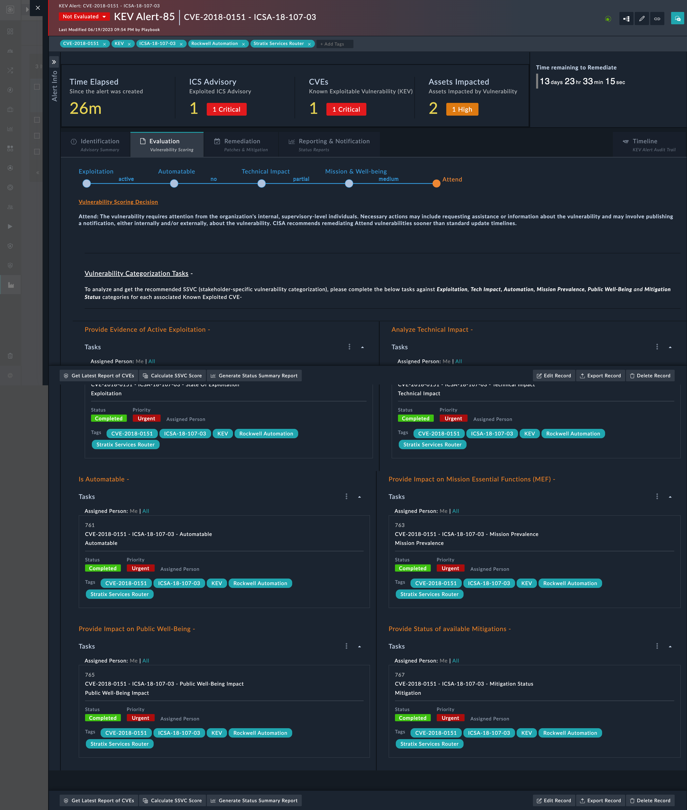

| [Home](../README.md) |
|--------------------------------------------|

# Usage

Refer to [Simulate Scenario documentation](https://github.com/fortinet-fortisoar/solution-pack-soc-simulator/blob/develop/docs/usage.md) to understand how to simulate and reset scenarios.

To understand the process FortiSOAR follows to respond to manage vulnerabilities in Operational Technology(OT). It provide a solution for handling the Known Exploited Vulnerability (KEV) ICS Advisory Alert. We have included a scenario &mdash; **OT - Known Vulnerability Exploit (KVE) Alert Raised For Asset At Risk** with this solution pack.

Refer to the section **OT - Vulnerability Management** to understand how this solution pack automation addresses your needs.

## OT - Vulnerability Management

## Simulation mode

The simulation mode has some sample data that helps you get a better understanding of how the solution pack functions. Following steps help you use the solution pack with some included sample data.

### Step to be followed before running Simulation:

1. Run the Simulation **OT - Add Sample Assets** from **OT - Asset Management** solution pack to get sample Assets.
2. To get real data of listed CVEs configure **National Vulnerability Database**

**OT - Known Vulnerability Exploit (KVE) Alert Raised For Asset At Risk**

- Browse to **Simulations** > **OT - Known Vulnerability Exploit (KVE) Alert Raised For Asset At Risk** scenario and click Simulate Scenario.
- List of Records get created.
    - CVEs:
        - CVE-2022-0847, CVE-2021-4034, CVE-2017-7269, CVE-2016-8562, CVE-2010-2568.
    - ICS Advisory:
        - USB Malware Targeting Siemens Control Software (Update C) - (ICSA-10-201-01C)
    - On Creation of KEV ICS Advisory KEV Alert get created:
        - ICSA-10-201-01C - Siemens
    - Mandatory Tasks(Under Evaluation Tab):
        - CVE-2010-2568 - State Of Exploitation **Urgent**
        - CVE-2010-2568 - Technical Impact **Urgent**
        - CVE-2010-2568 - Automatable **Urgent**
        - CVE-2010-2568 - Mission Prevalence **Urgent**
        - CVE-2010-2568 - Public Well-Being Impact **Urgent**
        - CVE-2010-2568 - Mitigation Status **Urgent**
        > **Note**: Mandatory task get created only for each KEV CVEs found in ICS Advisory.
    - Recommended Tasks(Under Remediation Tab):
        - ICSA-10-201-01C - Siemens - Make Permanent Configuration Changes
        - ICSA-10-201-01C - Siemens - Isolating vulnerable systems, applications, services, profiles, or other assets
        - ICSA-10-201-01C - Siemens - Limiting access
- To get the latest report of CVEs from NIST-NVD execute playbook **Get Latest Report Of CVEs**
- Identification tab contains the steps to be performed.
- Execute the appropriate playbook that is available by task type to completed all the **Mandatory Tasks**.
- After completing all **Mandatory Tasks**, execute **Calculate SSVC Score** to determine the score for each KEV CVE. Evaluation tab contains SSVC Score.

- Remediation tab also contains patch existence query as **Yes** or **No**. For each option related task get created.
> **Note**: If query value get changed, related task for patch get deleted and new task get created. On selecting **unknown** related patch task get deleted.
- Reporting & Notification tab contains the details of report and Additional Notes to be added in report.
- To create a report, run **Generate Status Summary Report**.

> **Note**: Please mark **Do Patch Exist?** as **unknown** before reseting scenario

## Real Mode

- Set global variable **Demo_mode** as **false**.
- In **02 - Use Case - ICS Advisory and CVEs** and **02 - Use Case - KEV Alert**, mark all of the playbooks that are available as active.
- Ingest KEV CVE using any of the below ways:
    - Trigger the schedule **Ingest KEV CVEs** to get all the KEV CVEs from NIST-NVD.
    - Execute **Ingest KEV CVEs** from CVE List View.
    > **Note**: Please wait till ingestion gets over.
- Playbook **Ingest KEV CVEs** contains **Configuration** step where you can modify variable **pageLimit** and **pageIndex** to acquire given number of data per page.
- Ingest ICS Advisory using any of the below ways:
    - Trigger the schedule **Ingest ICS Advisory** to get all ICS Advisroy 
    - Execute **Ingest ICS Advisory** from ICS Advisory List View.
    - Execute **Inject Advisory Through CSV File** from ICS Advisory List View. [Click here](./res/ics_sample_file.csv) to view the sample CSV file.
- KEV Alert Creation:
    - When an KEV ICS advisory is created, a **KEV Alert** is generated if it is discovered in the KEV and the system contains assets from the same vendor as the advisory.
    - Tigger **Create KEV Alert** on KEV ICS Advisory to create **KEV Alert**. 

## OT - Vulnerability Management Views

## CVE

## ICS Advisory

## KEV Alert

|  |  |
| :------------------------ |:------------------------|
| Identification Tab | Evaluation Tab | 

|  |  |
| :------------------------ |:------------------------|
| Remediation Tab | Report Tab |